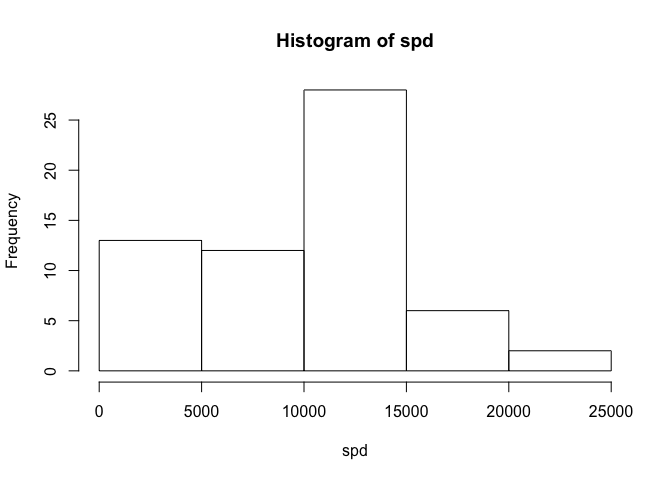
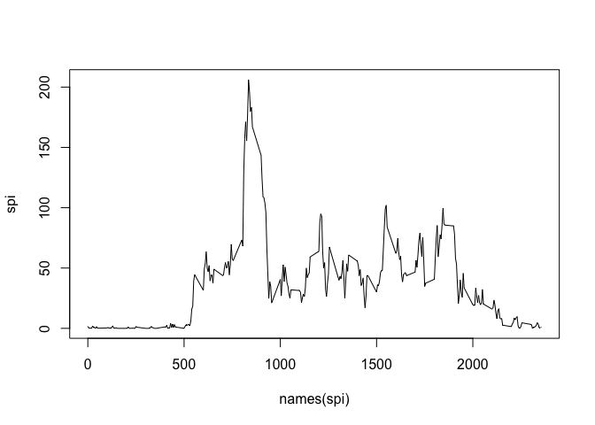
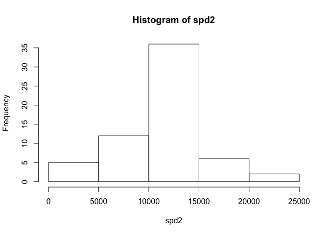
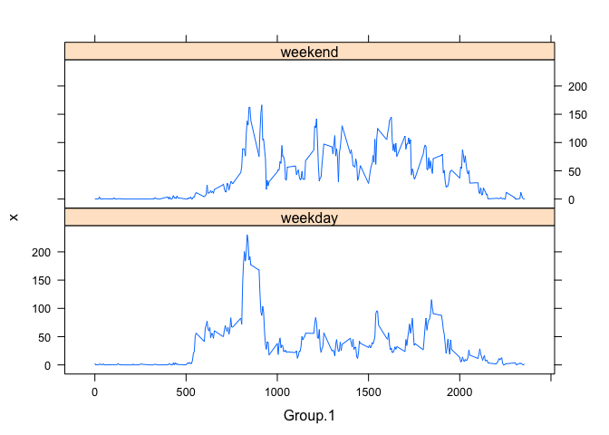

# Reproducible Research: Peer Assessment 1


## Loading and preprocessing the data


```r
unzip(zipfile = "activity.zip")
act <- read.csv("activity.csv", header = TRUE, sep=",",na.strings = "NA")
act <- transform(act, date=as.Date(as.character(date)))
```

## What is mean total number of steps taken per day?
Total number of steps taken per day is represented by spd

```r
spd <- with(act, tapply(steps, date, sum, na.rm = TRUE))
head(spd)
```

```
## 2012-10-01 2012-10-02 2012-10-03 2012-10-04 2012-10-05 2012-10-06 
##          0        126      11352      12116      13294      15420
```


```r
hist(spd)
```



Mean and median of the total number of steps taken per day

```r
mean(spd)
```

```
## [1] 9354.23
```

```r
median(spd)
```

```
## [1] 10395
```

## What is the average daily activity pattern?

```r
spi <- with(act, tapply(steps, interval, mean, na.rm=TRUE))
plot(names(spi),spi, type="l")
```




The maximum number of steps representing the 5-minute interval

```r
names(spi[which.max(spi)])
```

```
## [1] "835"
```
## Imputing missing values

The total number of missing values 

```r
length(which(is.na(act)))
```

```
## [1] 2304
```

Missing values are replaced with the mean for that 5-minute interval

```r
act[which(is.na(act$steps)),]$steps <- tapply(act$steps,act$interval,mean, na.rm=TRUE)
head(act)
```

```
##       steps       date interval
## 1 1.7169811 2012-10-01        0
## 2 0.3396226 2012-10-01        5
## 3 0.1320755 2012-10-01       10
## 4 0.1509434 2012-10-01       15
## 5 0.0754717 2012-10-01       20
## 6 2.0943396 2012-10-01       25
```


```r
spd2 <- with(act, tapply(steps, date, sum, na.rm = TRUE))
hist(spd2)
```



```r
mean(spd2)
```

```
## [1] 10766.19
```

```r
median(spd2)
```

```
## [1] 10766.19
```
## Are there differences in activity patterns between weekdays and weekends?

Creating a new two levels factor variable

```r
wd <- as.factor(weekdays(act$date, abbreviate = TRUE))
levels(wd) <- c("weekday","weekday","weekend","weekend","weekday","weekday","weekday")
act <- cbind(act,wd)
d <- aggregate(act$steps, by = list(act$interval,act$wd), FUN="mean")
```


```r
library(lattice)
xyplot(x~Group.1|Group.2, data=d, layout=c(1,2), type="l")
```


